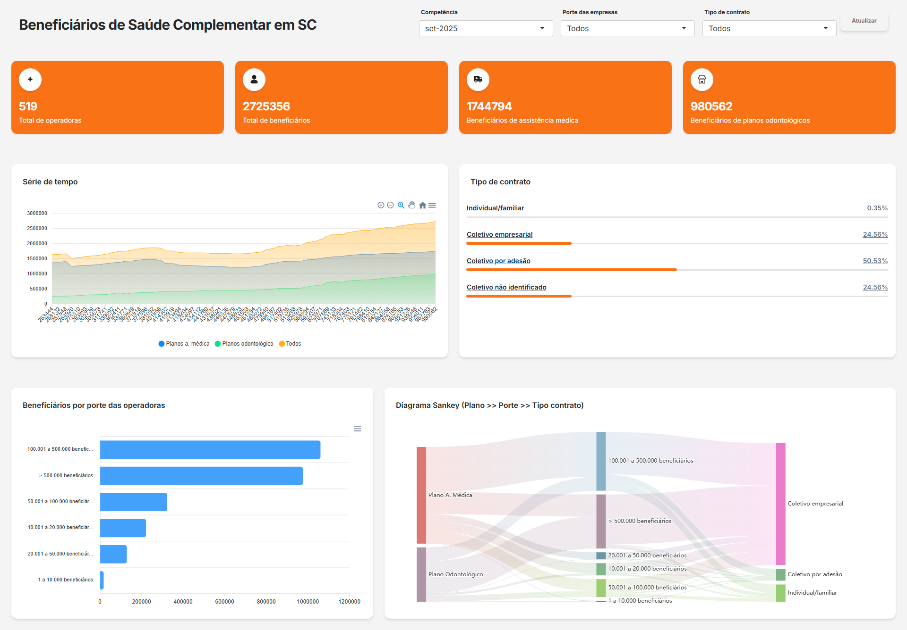

# Healthcare insurance beneficiaries dashboard

> A shiny app built using [Rhino](https://appsilon.github.io/rhino/index.html) framework and [*soft ui*](https://github.com/creativetimofficial/soft-ui-dashboard) template from Creative Tim's. The data used here was obtained from brazilian healthcare insurance regulatory agency (ANS), and can be obtained [here](https://dadosabertos.ans.gov.br/FTP/Base_de_dados/Microdados/)

### TODO's

The purpose of this repository is only to share code to others R Shiny developers. There are some bugs that i`ll fix over time

- [ ] Add a contingency table
- [ ] Fix the date format
- [ ] Add another tab with agency data
- [ ] Fix some filtered outputs